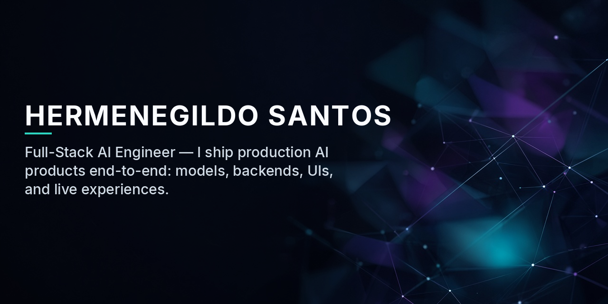

  

  
  
  
  

### About Me

Full-Stack Engineer at [Dorier](https://dorier-group.com) (Creative Tech / immersive AI live experiences), part of [MCI Group](https://www.mci-group.com/).

Helped deliver, with the Dorier team, an Azure Functions + Cosmos DB backend serving 2,100 concurrent users across 12 locations in 5 weeks.

Based in Portugal · experienced working remotely with distributed teams.

### Featured Work

| Project | What it is | Stack |
| --- | --- | --- |
| **Live-event AI Moderator** | Human-in-the-loop AI moderator for live enterprise panels — GPT-4o + realtime TTS, broadcast to a live audience over WebSockets. | FastAPI · React · Azure OpenAI · WebRTC · Docker |
| **Major gaming brand — global WebAR event** | Serverless backend for a global AR event — React admin dashboard. 2,100 concurrent users across 12 locations in 5 weeks. | Azure Functions · Cosmos DB · TypeScript |
| **[NexTool API](https://github.com/HermenySantos/nextool-api)** | 13+ developer-utility endpoints on Cloudflare's edge — sub-ms latency, monetized on RapidAPI. | TypeScript · Cloudflare Workers · Hono · Vitest |
| **[InvoFlow](https://github.com/HermenySantos/invoflow)** | Invoice/receipt SaaS for Portuguese SMBs — OCR extraction, real-time VAT tracking, accountant-ready export. | FastAPI · Next.js 14 · PostgreSQL · Azure Document Intelligence |
| **[Totem Proximity Flash](https://github.com/HermenySantos/totem-proximity-flash)** | Open-source extraction of the UN Geneva Visitor Center proximity feature — MQTT + Quuppa indoor positioning, 40 tests. | React Native · Expo · TypeScript · Reanimated |

  
  
  
  
  
  
  

